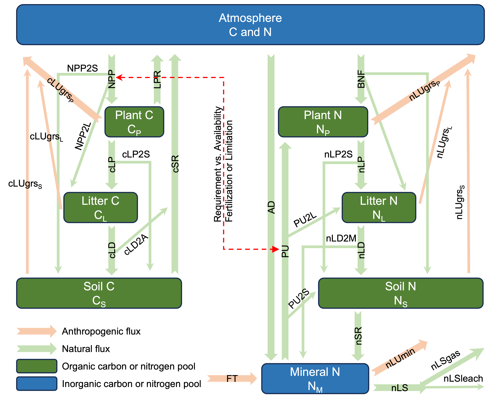

CNit Model Overview
===================

What is CNit?
-------------

CNit (Carbon-Nitrogen Interactions in Terrestrial ecosystems) is a process-based
terrestrial biogeochemistry model that simulates the coupled dynamics of carbon and
nitrogen cycles.  It is designed as the land component of MAGICC (Model for the Assessment
of Greenhouse Gas Induced Climate Change), providing a computationally efficient
representation of terrestrial carbon-nitrogen feedbacks for integrated assessment and
climate projection studies.

CNit answers questions about terrestrial biogeochemistry in the climate system:

- How does nitrogen availability limit carbon uptake by ecosystems?
- How do land use changes affect terrestrial carbon and nitrogen pools?
- What are the feedbacks between carbon and nitrogen cycles under climate change?
- How do CO₂ fertilization and warming interact with nitrogen limitation?
- What is the carbon sequestration potential of afforestation scenarios?

Conceptual Framework
--------------------

CNit represents the terrestrial biosphere as interacting carbon and nitrogen pools
connected by process-based fluxes. The model tracks both elements through their coupled
cycles, with explicit representation of nitrogen constraints on carbon uptake.

The model operates on annual timesteps, while capturing sub-annual processes through
empirically-derived allocation fractions that represent rapid cycling within each year.

Model Structure
---------------

Carbon Pools (3)
~~~~~~~~~~~~~~~~

**Plant Carbon Pool (CplsP)**
    Living plant biomass including leaves, wood, and roots.

**Litter Carbon Pool (CplsL)**
    Dead plant material undergoing decomposition.

**Soil Carbon Pool (CplsS)**
    Soil organic matter.

Nitrogen Pools (4)
~~~~~~~~~~~~~~~~~~

**Plant Nitrogen Pool (NplsP)**
    Organic nitrogen in living plant biomass.

**Litter Nitrogen Pool (NplsL)**
    Organic nitrogen in dead plant material.

**Soil Nitrogen Pool (NplsS)**
    Organic nitrogen in soil organic matter.

**Mineral Nitrogen Pool (NplsM)**
    Inorganic nitrogen (NH₄⁺, NO₃⁻).

Key Processes
-------------

Carbon Processes
~~~~~~~~~~~~~~~~

**Net Primary Production (NPP)**
   Carbon fixation by plants through photosynthesis.  Modified by:

   - CO₂ fertilization effect
   - Temperature effect
   - Nitrogen effect
   - Land use effect

**Litter Production Respiration (LPR)**
   Heterotrophic respiration associated with plant tissue fast turnover within one year.

**Carbon Turnover**
   - Litter production (cLP): Plant → Litter transfer
   - Litter decomposition (cLD): Litter → Soil transfer and respiration
   - Soil respiration (cSR): Soil organic matter decomposition

**Land Use Change**
   - Deforestation (cLUdfst): Carbon loss from land clearing
   - Afforestation (cLUafst): Carbon gain from reforestation
   - Regrowth (cLUrgr): Natural recovery after deforestation

Nitrogen Processes
~~~~~~~~~~~~~~~~~~

**Plant Nitrogen Uptake (PU)**
   Transfer of mineral nitrogen from soil to plants, driven by plant demand.

**Biological Nitrogen Fixation (BNF)**
   Conversion of atmospheric N₂ to organic nitrogen by microorganisms.

**External Inputs**
   - Atmospheric deposition (AD): Wet and dry deposition
   - Fertilizer application (FT): Anthropogenic nitrogen addition

**Nitrogen Turnover**
   - Litter production (nLP): Plant → Litter transfer
   - Litter decomposition (nLD): Litter → Soil transfer and mineralization
   - Soil respiration (nSR): Soil organic nitrogen turnover and mineralization
   - Mineral losses (nLS): Gaseous emissions and leaching

**Land Use Change**
   - Organic nitrogen losses (nLUgrs): From deforestation
   - Mineral nitrogen losses (nLUmin): Direct emissions during land conversion

Carbon-Nitrogen Coupling
~~~~~~~~~~~~~~~~~~~~~~~~~

The key feature of CNit is bidirectional coupling between C and N cycles:

**Nitrogen Limitation of Carbon Uptake**
   Nitrogen availability constrains NPP.  The model calculates nitrogen deficit:

   ..  math::

      PUdef = PUreq - PUavail

   where PUreq is based on potential NPP and stoichiometric requirements, and PUavail
   comes from mineralization and external inputs.  This deficit applies an exponential
   limitation effect on actual NPP.

**Carbon-Driven Nitrogen Demand**
   Carbon uptake drives nitrogen demand through fixed C: N ratios. Higher NPP increases
   nitrogen uptake requirements and can stimulate biological nitrogen fixation.

Key Model Features
------------------

Annual Timestep with Allocation Fractions
~~~~~~~~~~~~~~~~~~~~~~~~~~~~~~~~~~~~~~~~~~

The model uses annual timesteps for computational efficiency. Sub-annual processes are
represented through allocation fractions that capture carbon and nitrogen cascading
through multiple pools within one year (e.g., carbon fixed by plants that enters litter
through turnover and then enters soil through decomposition within the same year).

Explicit Deforestation-Afforestation Separation
~~~~~~~~~~~~~~~~~~~~~~~~~~~~~~~~~~~~~~~~~~~~~~~~

CNit separates gross land use emissions into:

- **Deforestation (LUdfst)**: Always positive, carbon loss
- **Afforestation (LUafst)**: Always positive, carbon gain
- **Regrowth (LUrgr)**: Natural recovery following deforestation
- **Afforestation decay (LUafst_decay)**: Gradual carbon loss from afforested areas

This separation is critical for carbon dioxide removal (CDR) scenarios where afforestation
plays a major role.

Nitrogen Deficit Feedback
~~~~~~~~~~~~~~~~~~~~~~~~~~

CNit explicitly calculates nitrogen deficit (PUdef = PUreq - PUavail), which:

- Creates nitrogen limitation on NPP (positive deficit reduces NPP)
- Can enhance NPP when surplus exists (negative deficit)
- Drives compensatory biological nitrogen fixation
- Affects decomposition rates through C-N coupling

Flux-Based Nitrogen Availability
~~~~~~~~~~~~~~~~~~~~~~~~~~~~~~~~~

Because mineral nitrogen has very fast turnover (days to weeks) compared to the annual
timestep, nitrogen availability is parameterized as a flux rather than a pool size. Net
mineralization is calculated from organic matter decomposition and provides an estimate
of plant-available nitrogen from internal sources.

Two-Stage Nitrogen Solution
~~~~~~~~~~~~~~~~~~~~~~~~~~~~

The nitrogen cycle is solved in two stages:

1.  Organic nitrogen pools (plant, litter, soil)
2. Mineral nitrogen pool using net mineralization from stage 1

This approach reflects the coupling between organic matter decomposition and mineral
nitrogen availability.

Environmental Effects
~~~~~~~~~~~~~~~~~~~~~

All process rates are modified by dimensionless effect factors:

**CO₂ Effect**
   Exponential enhancement of NPP with atmospheric CO₂ concentration.

**Temperature Effects**
   Temperature modifiers for NPP, respiration, decomposition, plant uptake, biological
   fixation, and mineral nitrogen losses.

**Nitrogen Effects**
   Exponential limitation of carbon processes (NPP, decomposition) based on nitrogen deficit.

**Land Use Effects**
   Modifications to process rates based on cumulative deforestation and afforestation history,
   blending equilibrium and instantaneous perspectives to capture transient dynamics.

When to Use CNit
----------------

CNit is Designed For:
~~~~~~~~~~~~~~~~~~~~~

✅ **Global-scale simulations** - Parameterized for global terrestrial biosphere

✅ **Century-timescale projections** - Annual timesteps suitable for multi-century simulations

✅ **Integrated assessment modeling** - Computational efficiency enables large ensemble studies

✅ **Climate-carbon cycle feedbacks** - Explicit CO₂, temperature, and C-N coupling

✅ **Land use change scenarios** - Explicit deforestation/afforestation for CDR analysis

✅ **Carbon budget analysis** - Mass-conserving structure for carbon accounting

Use Caution When:
~~~~~~~~~~~~~~~~~

⚠️ **Individual site simulations** - Not parameterized for site-specific characteristics

⚠️ **Sub-annual dynamics needed** - Annual timestep cannot resolve seasonal cycles

⚠️ **Spatial heterogeneity critical** - Pools are well-mixed, no spatial structure

⚠️ **Extreme events matter** - Fires, storms, pests not explicitly represented

⚠️ **Other nutrients limit** - Only carbon and nitrogen are modeled

Model Assumptions
-----------------

Key assumptions in CNit:

1. **Well-mixed pools** - No spatial heterogeneity or depth structure within pools.   All
   carbon and nitrogen in each pool is assumed to be uniformly mixed at the global scale.

2. **Annual timestep** - Sub-annual dynamics (seasonal cycles, daily variations) are not
   resolved.  Rapid within-year processes are represented through allocation fractions that
   capture cascading through multiple pools within one year.

3. **First-order kinetics with environmental modifiers** - All turnover processes follow:

   ..  math::

      Flux = \frac{Pool\ Size}{\tau} \times \prod Environmental\ Effects

   where τ is the baseline turnover time and environmental effects are multiplicative
   modifiers (temperature, nitrogen, land use).

4. **Constant baseline turnover times** - Turnover times (τ) are fixed parameters that do
   not vary with environmental conditions or ecosystem state.  Environmental responses are
   captured through effect modifiers rather than dynamically changing turnover times.

5. **Prescribed land use emissions** - Land use change is represented through prescribed
   emission fluxes (deforestation, afforestation, regrowth) provided as model inputs rather
   than computed from explicit simulation of land cover transitions, area changes, and
   ecosystem carbon/nitrogen densities.

6. **Fixed stoichiometric parameters** - Carbon-to-nitrogen ratios for plant uptake
   requirements (C:N ratios) are fixed parameters rather than dynamically varying with
   environmental conditions.   However, through carbon-nitrogen coupling, the model allows
   for emergent variability in ecosystem C:N ratios as nitrogen availability constrains
   carbon uptake and decomposition rates vary with substrate stoichiometry.

7. **No explicit vegetation types** - All vegetation is represented as a generic "plant"
   pool without differentiation of forests, grasslands, croplands, or plant functional
   types.

8. **Implicit microbial processes** - Decomposition occurs through parameterized first-order
   turnover rates rather than explicit representation of microbial biomass, enzyme dynamics,
   or microbial community composition.

Next Steps
----------

**Understand the Science:**
   See the API documentation at :doc:`api/cnit.physics` for detailed equations and scientific
   descriptions in the docstrings. For complete theoretical background and validation,
   see the published papers listed in the References section below.

**Start Using CNit:**
   Continue to :doc:`quickstart` to install CNit and run your first simulation.

**Browse Examples:**
   See :doc:`example` for common use cases and analysis workflows.

References
----------

**CNit Model Description:**

* Tang, G., Nicholls, Z., Norton, A., Zaehle, S., and Meinshausen, M.: Synthesizing
  global carbon–nitrogen coupling effects – the MAGICC coupled carbon–nitrogen cycle
  model v1.0, Geosci. Model Dev., 18, 2193–2230,
  https://doi.org/10.5194/gmd-18-2193-2025, 2025.

* Tang, G., Zaehle, S., Nicholls, Z., Norton, A., Ziehn, T., & Meinshausen, M.
  Understanding the Drivers of Carbon-Nitrogen Cycle Variability in CMIP6 ESMs
  with MAGICC CNit v2.0: Model and Calibration Updates. ESS Open Archive.
  June 16, 2025. https://doi.org/10.22541/essoar.175008280.09297369/v1 [accepted by
  Journal of Advances in Modeling Earth Systems (JAMES)]